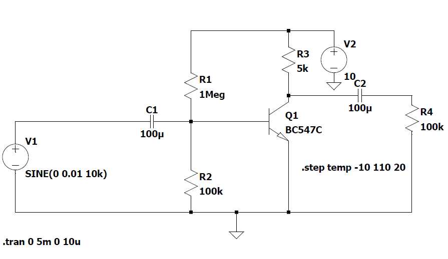
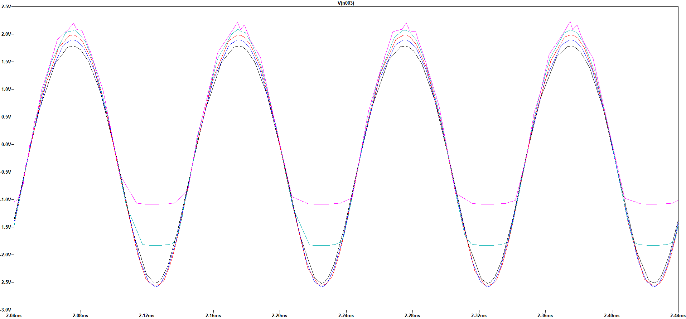
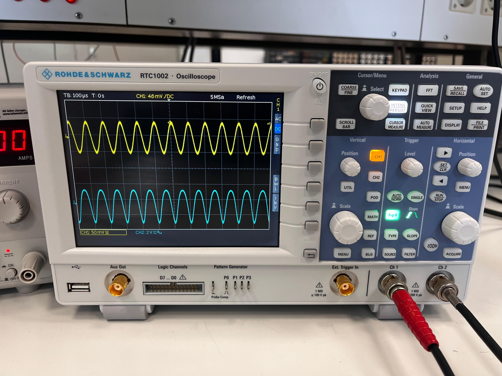

#  BJT Amplifier Thermal Response

This project analyzes how the gain and output waveform of a BJT common-emitter amplifier change with **temperature**. Simulations are performed in **LTspice** with temperature sweeping, and real-world oscilloscope results are used for validation.

---

## 📌 Objective

To investigate how a fixed-bias BJT amplifier behaves at various temperatures by:

- Running `.step temp` transient simulations in LTspice
- Measuring output waveform distortions and gain changes
- Comparing simulation results with real oscilloscope data

---

## ⚙️ Circuit Overview

The amplifier is configured in a **common-emitter topology** using a BC547C transistor.

- Input signal: 10 mV, 10 kHz sine wave (no DC offset)
- Output observed across 100 kΩ load
- Biasing network: voltage divider
- Capacitor-coupled input and output

<p align="center">
  
</p>

---

## 📈 LTspice Simulation Result

<p align="center">
  
</p>

> **Observation:**  
> - Low-temperature curves retain sinusoidal shape  
> - High-temperature curves (like 90–110 °C) show flattening due to non-linear gain behavior  
> - Gain increases at low temperatures and becomes unstable at high temperatures  

---

## 🧪 Oscilloscope Validation

<p align="center">
  
</p>

The real circuit measured at low temperature closely matches the simulation, showing ~40× gain and clean waveform shape.

---

## 📂 Repository Structure

```
BJT-Amplifier-Thermal-Response/
├── data/ # Output waveform files from LTspice (temp -10 to 70°C)
├── ltspice/ # .asc schematic file
├── report/
│ ├── BJT_Temperature_Report.tex / .pdf
│ ├── waveforms_all.png # LTspice waveform plot
│ ├── Schematic.png # Circuit schematic image
│ └── oscilloscope/ # Lab photos from Rohde & Schwarz
└── README.md
```

## 🛠 Tools Used

- LTspice XVII
- Rohde & Schwarz RTC1002 Oscilloscope
- LaTeX (for documentation)

---

## 👨‍🔬 Author

Mainak Roy | Universität Siegen 

